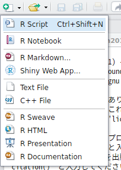
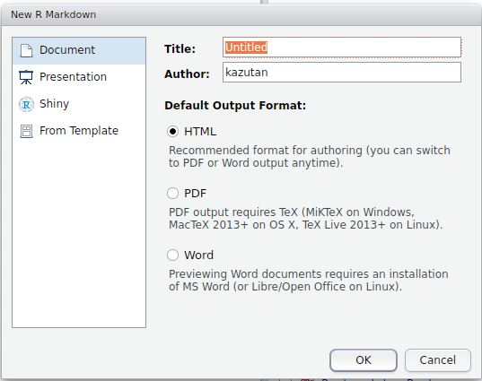
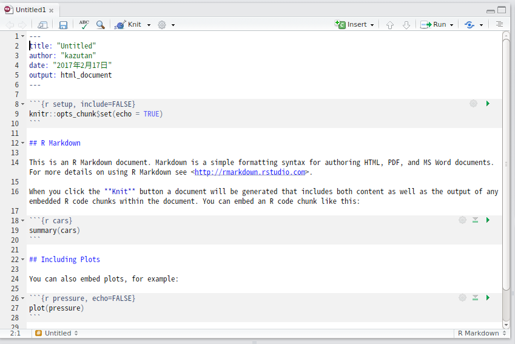
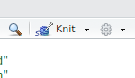
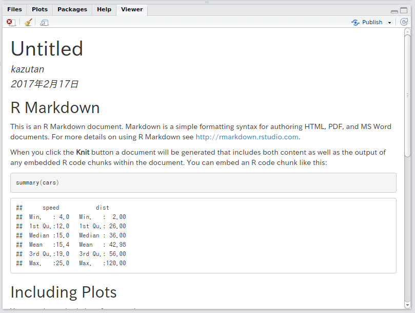
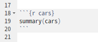
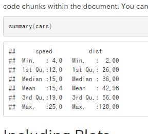

```{r setup, include=FALSE}
knitr::opts_chunk$set(echo = TRUE)
library(DiagrammeR)
```


# はじめに

## 自己紹介

<div class="column1">
- 比治山大学短期大学部
- @kazutan  
(Twitter, GitHub, Qiita)
- http://kz-md.net/
- http://blog.kz-md.net/
</div>
<div class="column2">

</div>

## 今回の内容

- R Markdownとは
    - 仕組みを簡単に紹介します
- Markdown記法
    - 必要最低限の説明をします
- R Markdownでドキュメント生成
    - 実際にファイルを使って説明します
- R Markdownでスライド生成
    - 実際にファイルを使って作ってみます

## 留意事項

- R Markdown初心者を想定
    - 基本的な内容を中心に構成
    - Rのコードはほぼ出てきません
- 資料は公開しています
    - https://github.com/kazutan/methoken201702
    - スライドや各種ファイルが置いてあります


# R Markdownとは

## Rでドキュメント生成

- Rはデータ解析
- 実はRでドキュメントを生成することが可能
    - R Markdownを利用
    - その便利さ、その将来性に注目が
- 今日はR Markdownによるドキュメントやスライド生成をご紹介

## Rでやるメリット

- 分析からレポート生成までが完結
    - WordもExcelも(そしてぱわぽも)いらない
    - コピペ汚染からの開放
- 再現性の確保
    - 同一の内容をそのまま再現できる
- 再利用、配布が簡単
    - コードを簡単に再利用可能
    - テキストデータなので運用が簡単
- 作るのが簡単
    - ドキュメント部分は基本Markdown
- and more!!

## R Markdownの基本的な仕組み

- 以下の2ステップでドキュメントなどを生成します
    - Rmdファイル内のRコードを評価
    - Rコードの出力をMarkdownに起こす
    - 出来上がったMarkdownファイルを変換
        - Pandocというソフトウェアを利用
        - RStudioに標準で組み込まれています

```{dot, echo=FALSE}
digraph knit {
  graph [
    label = "R Markdownの大まかな流れ",
    rankdir = LR,
    layout = dot,
    dpi = 450, 
  ]
  
  node [
    style = "solid, filled",
    fillcolor = Purple1,
    label = ".Rmd"
  ]
  A;
  
  node [
    style = "solid, filled",
    fillcolor = Violet,
    label = ".md",
  ]
  B;
  
  node [
    style = "solid, filled",
    fillcolor = LightBlue,
  ]
  C [label = "html, docs, pdf..."];

  A -> B [label = "knit"]
  B -> C [label = "Pandoc"]
  
}
```

## ワークフロー

1. R Markdownファイル(hoge.Rmd)を準備
2. 中身を記述
3. レンダリング(Knit)して出力を確認
4. 2と3を繰り返す
5. 完成

- 正直なところ，まずは**Markdownが書けて，Rチャンク(後述)を作れればOK**です
    - 様々な機能や設定は大量にありますが，デフォルトでも十分使えます
    - まずは早速使ってみましょう

## はじめてのR Markdown

<div class="column1">
1. Rmdファイルを作成
    - RStudioを起動
    - 画面左上のボタンから**R Markdown...**をクリック
</div>
<div class="column2">

</div>

***

<div class="column1">
2. 初期設定
    - Title: ドキュメントのタイトル
    - Author: 著者名
    - Output Format: ファイル形式
</div>
<div class="column2">

</div>

***

ファイルが作成され，自動で開きます:



***
<div class="column1">
3. Knitする
    - window上部の**Knit**ボタンをクリック
    - Rmdファイルのファイルを保存するダイアログボックスが表示
    - 保存したら実行されます
</div>
<div class="column2">

</div>

***

レンダリングが終了すると，自動的に`.html`ファイルが作成され，Viewerに表示されます:



## ワークフローの確認

1. R Markdownファイル(hoge.Rmd)を準備
2. 中身を記述
3. レンダリング(Knit)して出力を確認
4. 2と3を繰り返す
5. 完成

- というわけで，1と3の基本はこれでOKです
- 次に，中身の作り方を説明します

# Markdown記法

## Markdown(md)とは

- 文書を記述するための軽量マークアップ言語のひとつ
    - ドキュメント構造の基本的なものを提供
    - R Markdownはこれで文書を作ります
- mdには色々な"方言"が
    - RmdはPandoc Markdownです
- RStudioにはクイックリファレンスが
    - [Help] - [Markdown Quick Reference]
    - これみとけばOK

## 見出し(h1-h4)

<div class="column1">
- 文書構造を明確にするためにも、きっちり割り振る
    - レベル1は通常文書タイトル(章クラス)
    - レベル2は通常節クラス
    - 以下準じて下がっていく
- 極力見出しの前後は空行をいれとくといいです
</div>
<div class="column2">
```
# レベル1(h1)
## レベル2(h2)
### レベル3(h3)
#### レベル4(h4)
```
</div>

## 段落(p)と強制改行(br)

```
「もうすこしだ！　この山を越えると、梅の林がある。――疾く参って梅林の木陰に憩い、思うさま梅の実みをとれ。――梅の実をたたき落して喰え」

　聞くと、奄々と渇にくるしんでいた兵も、  
「梅でもいい！」  
「梅ばやしまで頑張れ」と、にわかに勇気づいた。

　そして無意識のうちに、梅の酸っぱい味を想像し、口中に唾をわかせて、渇を忘れてしまっていた。

　――梅酸渇を医す。
```

- 上下に空行を挟むと、そこを段落ブロック(p)として認識
- 行末に半角スペース2つ以上いれると強制改行(br)

## 番号なし箇条書き(ul>li)

<div class="column1">
```
- 箇条書き1
    - 箇条書き1-1
- 箇条書き2
    * 箇条書き2-1
    * 箇条書き2-2
```
</div>
<div class="column2">
- 記号とスペースの後に内容を記述
    - どちらでもOK
    - 行頭の空白4つで1レベル下がる
</div>

## 番号あり箇条書き(ol>li)

<div class="column1">
```
1. 番号1
    1. 番号1-1
2. 番号2
    1. 番号2-1
    2. 番号2-2
```
</div>
<div class="column2">
- 番号とピリオドとスペースの後に内容を記述
    - 行頭の空白4つで1レベル下がる
</div>

## コードブロック(pre>code)

<div class="column1">
- 入力した内容がそのまま表示されます
    - Rのコードは評価されません
</div>
<div class="column2">

````
```
(ここにコード記述)
```
````

</div>


## 強調表示

<div class="column1">
- 左のとおりです
- 強調具合などはCSSなどに依存します
</div>
<div class="column2">
```
*斜体*、もひとつ_斜体_
**太字**、もひとつ__太字__
```
</div>

## リンク、画像

<div class="column1">
```
- http://blog.kz-md.net/
- [リンク文字](http://blog.kz-me.net/)


```
</div>
<div class="column2">

- 基本、相対パスや絶対パスの両方OK
- URLでもOK
</div>

## その他

- 以下の内容もいけます
    - コードブロック
    - 引用
    - 脚注
    - Latex数式
    - 表
    - 水平線　etc...
- Pandoc Markdownなら大抵OKです
- その他，htmlタグ直打ちでもOKです
    - ただし，出力フォーマットがhtmlのみ

# R Markdownの書き方

## Markdownとの違い

- Markdownに**Rのコードを評価するブロック(Rチャンク)**と**ドキュメント設定用のYAMLヘッダ**を組み込めるようにしたもの
    - 拡張子は**.Rmd**
    - Markdownの基礎があれば、Rチャンクを少し勉強すれば利用可能
- RStudioを使うと抜群に楽になる
    - 専用の便利機能がたくさん
    - すぐに内容を確認(Preview)できる
    - 補完機能も充実

## 対応する出力形式

- いろんなものに対応しています(一部抜粋)
    - htmlファイル
        - 基本かつ**最強**。最もRmdを活かせるタイプ。
    - pdfファイル
        - tex環境が必要。いくつか地雷があるけど整えれば楽しい。
    - docxファイル
        - Officeをインストールしてなくても生成可能。
    - odtファイル
        - LibreOfficeなどで利用可能。
    - mdファイル
        - Githubやブログ記事向け。
    - rtfファイル
        - リッチテキスト形式。
    - その他いろいろ

## なにから手を付けるべき?

- まずはMarkdownに慣れる
    - 慣れないうちはQuick Referenceをみましょう
- Rチャンクに慣れる
    - いろんなコードを実行してKnitする
    - 基本的なチャンクオプションをおぼえる
- YAMLヘッダに慣れる
    - YAMLの書き方に慣れる
    - 基本的なオプションをおぼえる

これでOK。

# Rチャンク(chunk)の基本

## Rチャンクとは

- Rのコードを記述したブロック
    - 基本的な書き方は以下の通り
````
`r ''````{r}
head(iris)
`r ''````
````
    - ちなみに実行結果は以下の通り:

```{r r-chank-sample, eval=TRUE, echo=FALSE}
head(iris)
```

***

キャプチャするとこんな感じ:

<div class="column1">

</div>
<div class="column2">

</div>

## Rチャンクの基本

- Rチャンクはいくつでも設置可
    - チャンクに名前をつけることも可能
    - 結構詳細にオプションを設定可能
    - Rオブジェクトを引き継ぐことも可能
- 通常と(ほぼ)同じようにRが使える
    - パッケージ読み込みやファイルへのアクセス
- コードのみを実行可能
    - コードのみを実行すると`Global Envirnment`に
    - Knitした場合，別のEnvironmentで実行される
    - cacheしておくことも可能(今回は省略)

## Rチャンク オプション

- そのRチャンクでの設定を記述
    - 設定項目はたくさんある
    - そのあたりはリファレンスを参照
    - 以下、絶対覚えるべきものだけ紹介

````
`r ''````{r chank-name, eval=TRUE}
head(iris)
`r ''````
````

## echo(コード部の表示・非表示)

- Rのチャンクコードを表示させるかどうか
    - `echo=FALSE`で非表示
    - あくまで表示に関することだけ
    - コード評価をするかどうかは影響しない

````
`r ''````{r, echo=FALSE}
head(iris)
`r ''````
````

## eval(コード部の評価・非評価)

- Rチャンクのコードを評価するかしないか
    - `eval=FALSE`で非評価

````
`r ''````{r, eval=FALSE}
head(iris)
`r ''````
````

## include(レポートに組み込むか否か)

- Rチャンクをレポートに組み込むかどうか
    - `include=FALSE`でレポートから除外
    - でもコードは評価されます
    - セットアップとか前処理とかパッケージ読み込みとかで重宝

````
`r ''````{r, include=FALSE}
library(zousan)
`r ''````
````

# R Markdownでスライド生成
